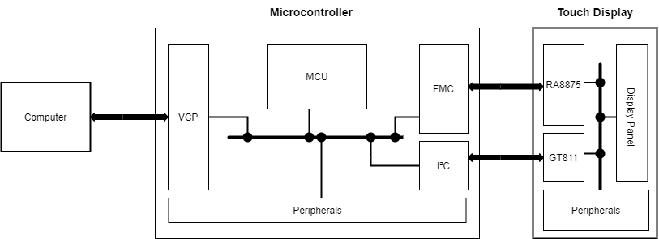
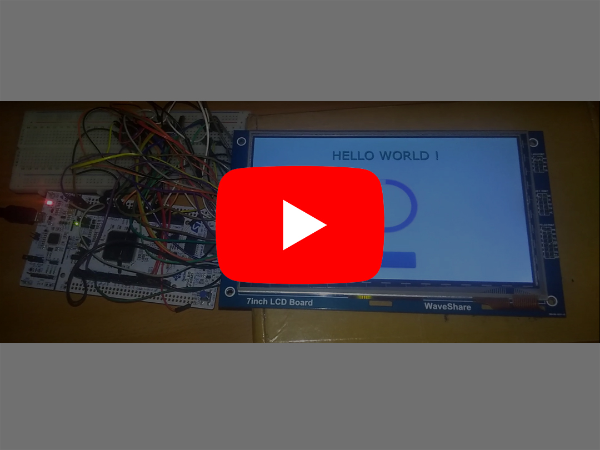

# TEST : Waveshare 7" Capacitive Touch Screen 800x480 + STM32F429ZI + touchGFX

## GOALS
- Identify the key components of a display driver
- Test the equipment available

## Equipment
### STM32F429ZI Microcontroller
- 2Mb of Flash Memory 
- 256Kb of RAM
- Up to 180Mhz clock speed
- Chrom-ART accelerator built around a 2D DMA engin
- Embedded LCD-TFT Display Controller __(LTDC)__ (that we didn't use because we don't have the right display)
- Flexible Memory Controller __(FMC)__ (to interface with external memories)

### Waveshare 7" Touch Screen
- 800x480 resolution
- 16 bits colors
- Embedded Display Controller __(RA8875)__
- Embedded Touch Controller __(GT811)__

## Software tools
- TouchGFX for GUI development

## Functional Block Diagram

## Aditional informations
For more details about how to :
- Setup the project on your own IDE
- Controll the display
- Get started with TouchFGX

Take a look to the __WIKI page (currently unavailable)__

## Demo Video

